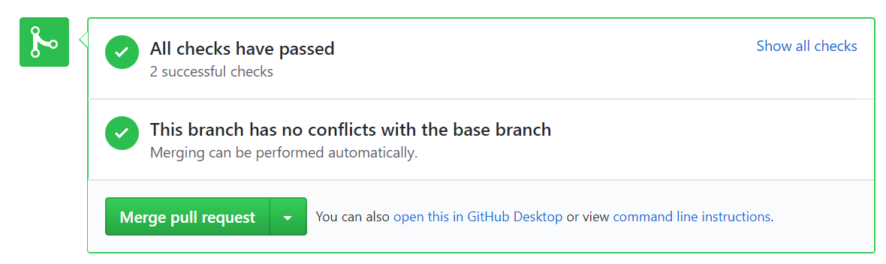
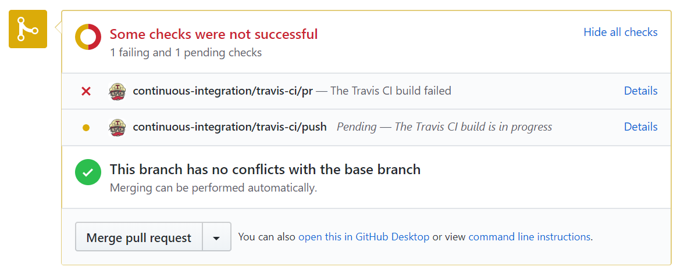
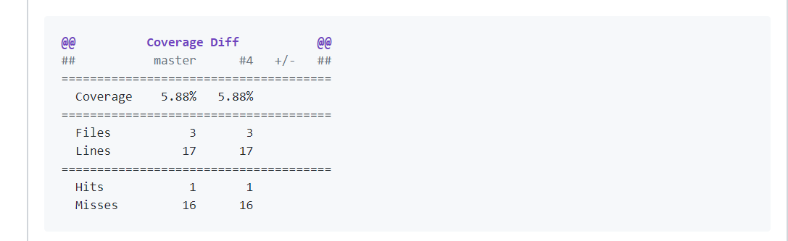

# Free and easy Continuous Integration for your GitHub project with three easy steps - build, test, deploy

Hi guys! Today we will learn how to setup Continuous Integration process for the C# project hosted on GitHub. This is very easy, can really improve your code quality and you always be sure that no one destroys your code with latest commit. Are you interested? Let's give it a try!

## You will need

* [GitHub account](https://github.com)
* [.NET Core SDK > 2.1.](https://www.microsoft.com/net/)
* [Visual Studio 2017](https://www.visualstudio.com/)
* [Azure account](https://portal.azure.com/) - optional

Let's start.

## Start a new project

Create a new repository on GitHub and clone it locally. Don't forget to select .gitignore file template for VisualStudio to keep your repository clean and nice. Than generate new .NET Сore web application with

```cmd
dotnet new sln --name CIDemo
dotnet new web --name web
dotnet sln CIDemo.sln add web/web.csproj
```

Commit your changes directly to master and push them to the remote.

## CI Build

Now we will setup first step of the CI process - build check.

Go to the [Travis](https://travis-ci.org/) and log in with GitHub account. Give Travis access to your repository.

Go back to the repository, create new branch CIBuild and add the .travis.yml file to the root of the folder

```text
language: csharp

dotnet: 2.1.4
sudo: false

env:
    global:
        - DOTNET_CLI_TELEMETRY_OPTOUT: 1

script:
    - dotnet build CIDemo.sln -c Release
```

.travis.yml file will keep your Travis settings and configure your CI process. Right now it contains:

* language - your programming language.
* dotnet - version of the required dotnet SDK
* env - environment variables passed to the build process. I've added DOTNET_CLI_TELEMETRY_OPTOUT to [switch off](https://docs.microsoft.com/en-us/dotnet/core/tools/telemetry) telemetry.
* script - commands for Travis.

Commit and push your changes, then make a pull request. Now you should see something like this:



This means that all is going ok. If you create a pull request that will not be buildable, Travis will report this.



Don't forget to take build badge from the personal cabinet.
[](https://travis-ci.org/Drag13/CIDemo)

## CI Tests

Now let's configure tests for our CI process. The main idea of this step is to check that new code doesn't break your existing code and keep code coverage on the acceptable level.

Inside the solution, create the new project Test. Add [coverlet.msbuild](https://github.com/tonerdo/coverlet) NuGet package to the Test project. It will generate code coverage report file.

```cmd
dotnet new xunit --name test
dotnet add test/test.csproj package coverlet.msbuild -v 1.2.0
dotnet sln CIDemo.sln add test/test.csproj
```

Inside web project create the new class

```c#
using System;

namespace web
{
    public class IdProvider
    {
        public Guid NewId()
        {
            return Guid.NewGuid();
        }
    }
}
```

Inside the Test project create the new class

```c#
using web;
using Xunit;

namespace test
{
    public class IdProviderTest
    {
        [Fact]
        public void NewIdShouldReturnUniqueValues()
        {
            var idProvider = new IdProvider();
            var id1 = idProvider.NewId();
            var id2 = idProvider.NewId();

            Assert.NotEqual(id1, id2);
        }
    }
}
```

Update travis.yml file and add this line to the script section:

```cmd
 - dotnet test -c Release --no-build test/test.csproj /p:CollectCoverage=true /p:CoverletOutputFormat=opencover
```

If you want you can specify threshold level:

```cmd
dotnet test /p:CollectCoverage=true /p:Threshold=TRESHOLD_LVL
```

If your code coverage becomes lower than TRESHOLD_LVL you will receive an error. This is useful when you like to have not less than the certain level of code coverage

Go to the [Codecov](https://codecov.io), log in with your GitHub account and give access to your repository.

Add this to the end of the .travis.yml file

```text
    after_script:
        - bash <(curl -s https://codecov.io/bash)
```

Commit and push. Now you should see something like this



Don't forget to take second badge.


## CI Deploy to Azure

Here I will show how to setup deploymnt to Azure. But if you don't want to use Azure, Travis supports a lot of other deployment targets like Google and Amazon. [Here](https://docs.travis-ci.com/user/deployment/) you can read more about deployment directly from Travis.

Default deployment to Azure is very simple. It is already tuned to work with .NET Core applications out of the box. So the only thing you need is to give Azure access to your repository and synchronize them. All other stuff will be done automatically.

Login to [Azure](https://portal.azure.com) and create new site with this link
[link](https://portal.azure.com/#create/Microsoft.WebSite). Specify site name, subscription, and Operating System. Than select DeploymentOptions -> Github -> Project -> Branch. After this, your remote repository will be synced with GitHub and a few minutes later - deployed.

## CI Deploy to Azure - Advanced

But what if you need to do some advanced stuff like build UI, update web.config, or other something other? The cool thing that deployment process is fully configurable. All you need is to specify build script and describe steps you want to see.

Go back to the repository. Add two new files to the root of the project

* [.deployment](https://github.com/Drag13/CIDemo/blob/master/.deployment) // describes deployment steps
* [build.cmd](https://github.com/Drag13/CIDemo/blob/master/deploy.cmd) // describe deployment process

The build.cmd file may look a bit scary but in fact, it is very simple. Here what is going inside

* Setup paths
* Install [kudusync](https://github.com/projectkudu/KuduSync)
* Restore NuGet packages
* Publish application
* Copy publish result to the site folder

The main idea is that this is only cmd script that allows you to do everything you need. You can use dotnet, NuGet, node, npm and other tools to customize your build process whatever you want. If you want to read more about deploymnt to Azure you can read this article - [How to build and deploy your front-end application from GitHub to Azure with Kudu](https://medium.com/@drag13dev/how-to-sync-your-github-repository-and-azure-40bdb564d788)

That is all! Hope this will help you to make your applications better. Have a nice day!

## Other CI tools

Travis is not the only one can help you with free CI.
You also can check next projects:

* [codeship](https://codeship.com/pricing) (free for OpenSource)
* [circleci](http://circleci.com/pricing/) (free 1,500 build minutes per month, special offers for OpenSource)
* [buddy](https://buddy.works/pricing) free (120 executions/month)

## Useful Links

* [Travis documentation](https://docs.travis-ci.com/)
* [Codecov documentation](https://docs.codecov.io/docs)
* [Coverlet documentation](https://github.com/tonerdo/coverlet/blob/master/README.md)
* [Kudusync](https://github.com/projectkudu/KuduSync)
* [DemoRepository](https://github.com/Drag13/FSharpWebAppWithCIDemo)
* [How to build and deploy your front-end application from GitHub to Azure with Kudu](https://medium.com/@drag13dev/how-to-sync-your-github-repository-and-azure-40bdb564d788)
