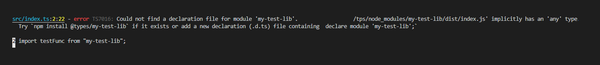

# How to add custom types to the TypeScript project

Working with TypeScript is very comfortable. It provides Intellisense, type-checking, and makes the developer's life much easier. But, sometimes, when I am using external libraries, I got a problem. They don't provide types or shipped types that are outdated. In this case, there is no other option but to define custom typings my own. Luckily, it's not that hard as you may expect.

## Before we start

Before you start adding custom types you need to ensure that there are no original types. Nowadays, packages that don't ship typings with themselves could be found under ```@types/package-name```. So, first of all - check ```@types```. And only if there is nothing suitable, create your own.

## Create custom typings

So, we need to create custom typings. Imagine that we are using library "my-test-lib" and need to provide types for it.

```typescript
import mainAnswer from 'my-test-lib';

const answer = mainAnswer();
console.log(answer);
```

Here is the example of the 3rd party code we will annotate:

```js
function main_answer() {
  return 42;
}

module.exports = main_answer;
```

* Create a root folder for your types. You can give any name for it but let it be `types` for now.
* Create `my-test-lib.d.ts` file inside the types folder (name also can be any, it doesn't matter)
* Put this example inside the file

```typescript
declare module "my-test-lib" {
  export default function main_answer(): number;
}
```

That's it! Now it should work! The main trick is to **name module with the same name as library you want to annotate**. TypeScript is smart enough to automatically find your custom types, match module name with library name, and use types from the declaration.

But sometimes this will not work.

## Could not find a declaration file for module 'my-test-lib'

You did everything right but tsc still failing with:



> "Could not find a declaration file for module".

What is wrong? One of the reason might be that you are using include and/or files option in tsconfig.json, like here:

```json
  "files": ["./src/index.ts"]
  "include": ["./src"],
```

In this case, TypeScript will not search for your types anywhere except node_modules and your src folder. And if you put types to the `.root/types` it will not pick up them. That's why you see this "Could not find a declaration" error. To fix this you need to include a folder with types, using include option, like this:

```json
"include": ["./src", "./types"],
"files": ["./src/index.ts"]
```

Another reason, why you see this error might be because you are using the wrong tsconfig.json file. As an example, Angular creates several tsconfig.json files used for different purposes (testing, production build, etc). So, don't forget to check the correctness of the tsconfig files.

## Few words about typeRoots

What about "typeRoots"? Isn't this option should fix all issues? The quick answer is - no. Typeroots option was created [only for the backward compatibility](https://github.com/microsoft/TypeScript/issues/22217#issuecomment-370019383), so in certain circumstances, it might help but should be avoided if possible. However, VsCode uses this option to pick-up types for IntelliSense, so be aware :)

## Troubleshooting

TypeScript is much more complicated than we see. Sometimes, despite all efforts, types will no be applied. In this case, I would recommend using ```--traceResolution``` flag to check how tsc tried to resolve modules. This might save a couple of hours for you.

Hope this helps, see you soon!