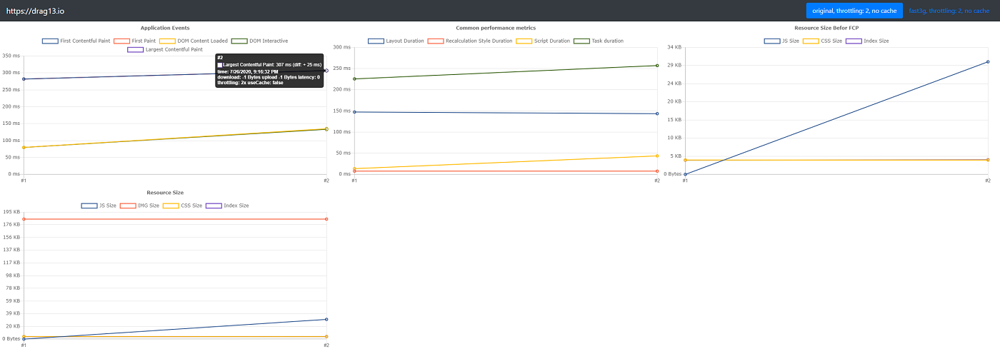
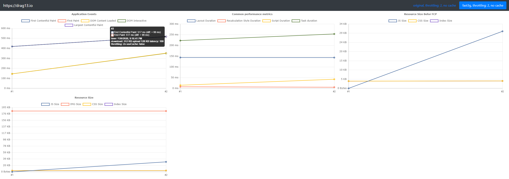

# Perfrunner - an automated testing tool to check your web site performance improvements against various conditions.


## Quick intro

A few months ago I worked on performance improvements for one React-based web application. I tried different tricks to improve initial application loading and I was really annoyed with the way of testing my changes. I had to launch the application several times to get average results. I had to repeat all launches against at least two types of networks (4g and my current). And I had repeat abovementioned tests once again for cache and cache-less scenarios. For the one single change, I had to run at least 12 tests. Needless to say, this was not fun.

I decided that I don't want to do this anymore and this is how the [Perfrunner](https://github.com/Drag13/perfrunner) appeared.

Perfrunner is a simple CLI tool that launches your web site or web application, collects performance metrics, and reports them back to you. The cool part is that Perfrunner does not only a single run but a series of runs against different networks, cache and CPU conditions!

In other words, Perfrunner loads your application several times (3 by default) against each condition, calculates average results, and displays you the difference between all previous runs. You don't have to run them manually anymore or calculate difference anymore, it is all automated!

## Demo

Let's start from a simple demo.

First things first, you need to install Perfrunner and add launch script to the package.json file:

```cmd
npm i perfrunner -D
```

```json
{
  "scripts": {
    "perfrunner": "perfrunner"
  }
}
```

and run Perfrunner to get inital data.

```cmd
npm run perfrunner https://drag13.io
```

Now, change something that might affect performance (I added jQuery to the top of the page) and run Perfrunner one more time. Open folder named `generated/{your_site_name}` and then open a `default-report.html` file.

It will look like this (clickable):

<a href="./original.png" target="_blank" ></a>

In this report you will see at least four different charts:

- Application Events with `First-Paint`, `First-Contentful-Paint`, `Largest-Contentfult-Paint`, `DomContentLoaded` and `DomInteractive` events
- Common performance metrics like `Layout Duration`, `Script Duration` and `Recalculate Style Duration`
- Size of the resources loaded before the First-Contentful-Paint event
- All resources size

If you are using performance marks, you will also get marks chart as well.

But what is perhaps the most important point, you can switch to the second tab and see how your changes affect the performance for another network/CPU/cache conditions:

<a href="./fast3g.png" target="_blank" ></a>

As you can see, for the fast-3G network, the First-Contentful-Paint event appeared 75 ms later than for the regular network.

You can also instruct Perfrunner to use additional network conditions, like `slow-3g` or `regular-4g`:

```cmd
npm run perfrunner http://drag13.io -- --network slow-3g fast-3g hspa regular-4g online
```

or you can do testing against cached or not cached resources:

```cmd
npm run perfrunner http://drag13.io -- --cache true false
```

And of course you can combine different options together to get as much information as you need:

```cmd
npm run perfrunner http://drag13.io -- --network slow-3g fast-3g hspa regular-4g online --cache true false
```

Apart from network conditions, Perfrunner also supports CPU throttling with -T flag:

```cmd
npm run perfrunner http://drag13.io -- -T 8
```

This will set 8x throttling for your CPU. It is useful when you want to test your changes against slow devices.

For more available options, please check [readme](https://github.com/Drag13/perfrunner/tree/development/packages/perfrunner-cli#all-options)

## Advanced tricks

Perfrunner is more flexible than it appears at first sight. First of all, if you don't want default-html reporter, you can switch it to CSV or JSON format, using `--reporter` flag. You also can write your own reporter and use it with option:

```
npx perfrunner http://drag13.io --reporter my-custom-reporter.js
```

where reporter should look like:

```js
module.exports = (outputFolder, data, args) =>
  console.log(outputFolder, JSON.stringify(data), args);
```

Another useful trick is that Perfrunner also collects all Chrome traces from every test run. If you will need more detailed information, you can open `generated/{your_site_name/traces}` and get all the additional information you need.

## Troubleshooting.

Perfrunner is based on [puppeteer](https://github.com/puppeteer/puppeteer), so it has all weaknesses and advantages of it. If you struggle with launching Perfrurunner, please visit [troubleshooting](https://developers.google.com/web/tools/puppeteer/troubleshooting) page. From my side, Perfrunner supports `--chrome-args` and `--ignore-default-args` flags. It also supports `--executablePath`, so you can launch Perfrunner on your own Chrome instance if nothing else helps.

## Final words

Summarizing, Perfrunner is a great tool to quickly check your performance improvements. It supports various network conditions, CPU throttling, and much more. If you have any questions, suggestions, or found an issue, feel free to visit [github](https://github.com/Drag13/perfrunner/issues) or contact me on [twitter](https://twitter.com/drag137).

Wish you the fastest app!