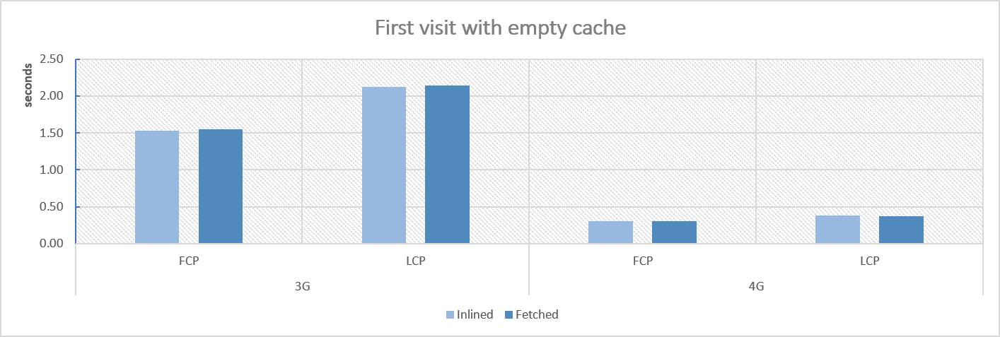

# How to use React without unsafe-inline and why.


React.JS is an awesome library that widely used all over the world. However, it also contains some pitfalls that might negatively impact your application. And here I want to discuss one of such pitfalls - inlined runtime chunk that might prevent you from correct using one of the most useful security header - Content-Security-Policy.

## Identifing the issue

Let's start. If you ever opened the built index.html, you probably already saw something like this:

```html
...
<!--index.html-->
<div id="root"></div>
<script>!function (e) { function r(r) { for (var n, l, f = r[0], i = r[1], a = r[2], c = 0, s = []; c < f.length; c++)l = f[c], Object.prototype.hasOwnProperty.call(o, l) && o[l] && s.push(o[l][0]), o[l] = 0;}</script>
<script src="/static/js/2.1478fb8e.chunk.js"></script>
...
```

What is this first piece of code? It is a small chunk of webpack runtime logic which is used to load and run your application. It is safe (at least for now), already optimized, and minified. If you remove or alter it, your application will be broken. Despite all of this, the fact it uses an inline technique might bring you some trouble if you start improving your application with [Content-Security-Policy](https://developer.mozilla.org/en-US/docs/Web/HTTP/CSP) HTTP header. For those, who already CSP Header, the problem should be obvious, but if you are not familiar with this technique, I will explain a bit more.

A long time ago when [netscape](https://en.wikipedia.org/wiki/Netscape_Navigator) was young, we don't have any mechanism to define trusted sources browser may use safely. If the browser saw the script tag, it evaluated it and executed it. If the browser saw a script with src, it loaded it and executed it. If the browser saw an image ... you understand, it loaded image and render it. Despite (or because) the simplicity, this behavior opens door to some troubles like [XSS](https://developer.mozilla.org/en-US/docs/Glossary/Cross-site_scripting).

However, times changed. Nowadays we can control what sources are trusted and what resources can be used by the browser. This is done by the HTTP Header named Content-Security-Policy. This header defines whitelists the trusted sources:

```
Content-Security-Policy: default-src 'self';
```

In this example, the server, using Content-Security-Policy header, dictates to the browser to use resources only from the same domain index.html was loaded from. If an attacker will find XSS vulnerability and embed some script inside the page, the browser will refuse to load it, because loading scripts from other domains already forbidden. And if attacked embed plain javascript on the page, payload will also not work. Because inline resources required special permission - unsafe-inline.

```
Content-Security-Policy: default-src 'self'; script-src 'unsafe-inline';
```

This header is so cool, that it can also forbidd [eval](https://developer.mozilla.org/en-US/docs/Web/JavaScript/Reference/Global_Objects/eval) wich makes this header really great agains different types of injection-based attacks. If you are interested in some details, here you can find more about Content-Security-Policy and some other useful security headers - [drag13.io/posts/security-headers].

Now you should see the issue. If you decide to protect your site with CSP-Header (and I highly recommend doing this), you will have to allow unsafe-inline, because, in another case, React will just not work. Which in turn, leaves the door open to other, potentially malicious, inlinings.

## Making the decision

Now, when you see the issue, what can you do?

* Use [nonce](https://developer.mozilla.org/en-US/docs/Web/HTTP/Headers/Content-Security-Policy/script-src) attribute. However it requires some backend (nonce should be cryptographically secure random token) and Edge had some bugs related to it. So this might be plan B.
* Opt-out from using unsafe runtime script inlining. The good news is that this option is already supported with INLINE_RUNTIME_CHUNK variable and it is quite easy to set up it. To use react without unsafe inline code, you need set ```INLINE_RUNTIME_CHUNK``` to false, like here:

```json
/*package.json*/
"build": "(SET INLINE_RUNTIME_CHUNK=false) && react-scripts build",
```

Or just use add INLINE_RUNTIME_CHUNK=false to the [.env](https://create-react-app.dev/docs/adding-custom-environment-variables/) file. Now your inlined chun will be moved out of the index.html. However this is not end. Except runtime chunk, react also inlines images that are smaller then 10kB. Inlined images are also forbidden by default with CSP header. You may leave as it is or, setup React not to include images inside the bundle.  Just add
```IMAGE_INLINE_SIZE_LIMIT=0``` to your .env file and that's it.

Now you can use React.JS application with CSP header without unsafe-inline (of course if you don't have other inlined code).

But what about performance? If we moved runtime-chunk out from the index.html, doesn't it slow the application loading? I was also wondering about this. So, I created a simple web application in Azure (B1 if you are wondering), built default React application, and did a couple of tests with [perfrunner](https://www.npmjs.com/package/perfrunner). And here is what I've found

## Profiling

### First visit



### Cache enabled


As you can see, allmost no difference appears. If you prefer to check raw numbers, here are the results:

| | 3G first-visit | | 4G  first-visit| | 3G cache| | 4G cache| |
|--| --| -- | -- | --| -- | -- | ---| --|
| | FCP | LCP | FCP | LCP | FCP | LCP | FCP | LCP |
|Inlined| 1532  | 2126 | 307 | 383 | 732 | 732 | 236 | 236 |
|Cached| 1545 | 2142 | 301 | 370 | 729 | 729 | 217 | 217 |

So, from performance perspective, using fetched runtime chunk also seems safe.

## Summary

Making React applications compliant with Content-Security-Policy is easy and can be done with a few simple settings in the .env file - ```IMAGE_INLINE_SIZE_LIMIT``` and ```INLINE_RUNTIME_CHUNK```. Despite the simplicity, it still requires careful verification of everything connected to the security.

Hope this helps,

// [Drag13](https://drag13.io/)